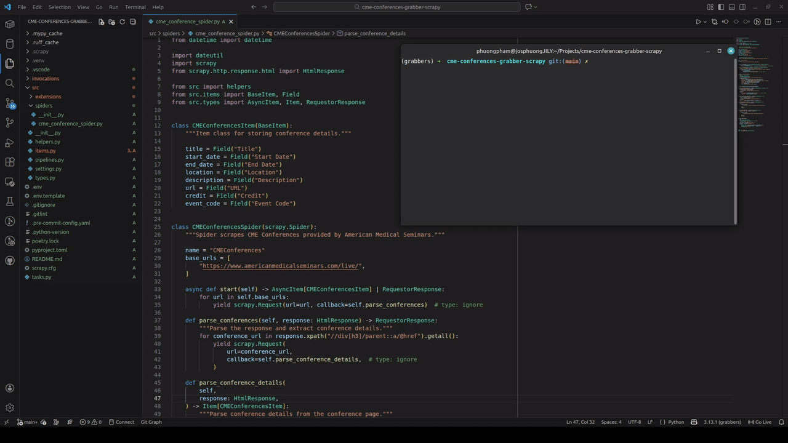

# Description

A sample Scrapy project which scrapes CME Conferences provided by American Medical Seminars.
([Website URL](https://www.americanmedicalseminars.com/live/))



## Installing project for developing on local PC

You have to have the following tools installed prior initializing the project:

- [uv](https://github.com/astral-sh/uv)
- [poetry](https://python-poetry.org/docs/#installation)

### TL;DR

If you already configured uv, poetry, and webdrivers, you may use
following commands to start local development:

```bash
uv venv --python 3.13 --prompt grabbers --seed
source .venv/bin/activate
poetry install --only local
inv project.init
```

### Prepare python env

1. Install python:

   ```bash
   uv python install 3.13
   ```

2. Config poetry and install build tools:

```bash
poetry config virtualenvs.in-project true && poetry install --only local && source .venv/bin/activate
```

3. Start project initialization that will set up python/system env, update and install dependencies:

```bash
inv project.init
```

## Run/debug grabber

Scrapy requires setting of environment variables, see `.env` for details.

One liner to run single spider:

`inv grabbers.run --name {spider_name}`

`spider_name` can be grabber's name, path to grabber, grabber's module name or
grabber's class name

`--brief-logs` argument may be used in order to hide all logs from the grabber.
(In this case there will be presented only logs about warns, errors and
successful runs.)

This command will create `out.xlsx` file with export results.

## Run linters

All linters are managed using [`pre-commit`](https://pre-commit.com/)
tool, so in order to run linters use

```bash
inv pre-commit.run-hooks
```
